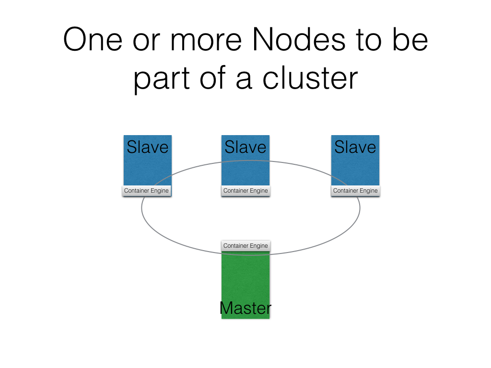
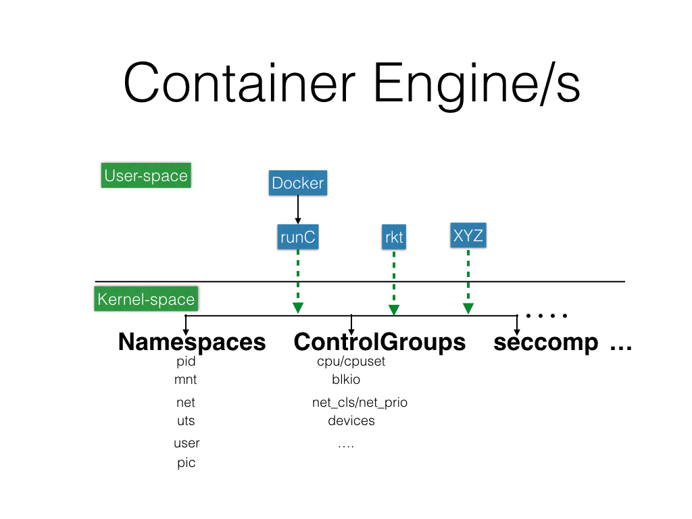
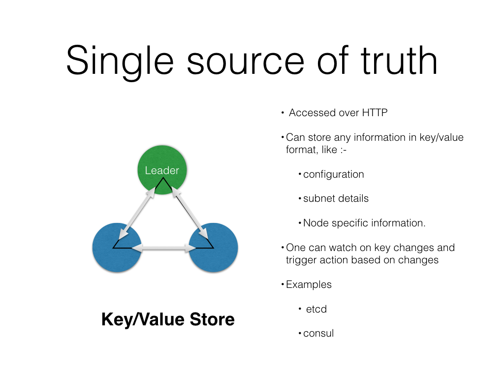
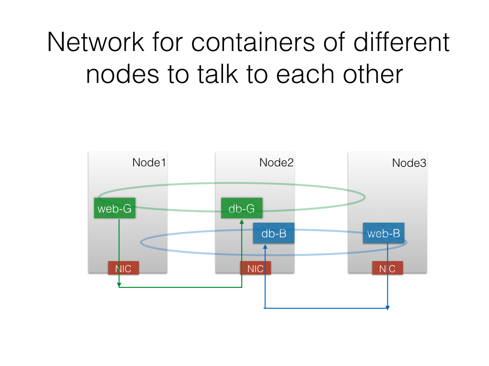
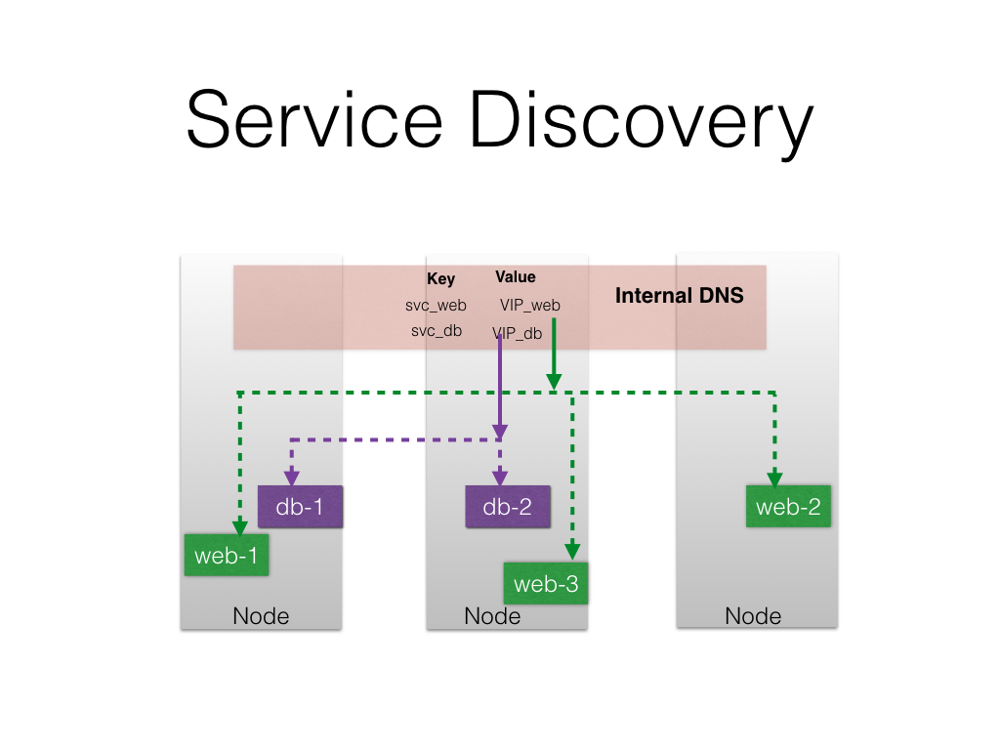
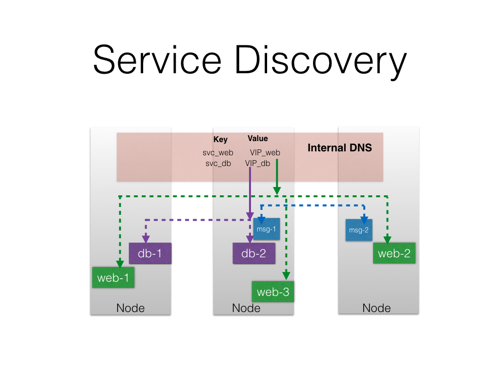
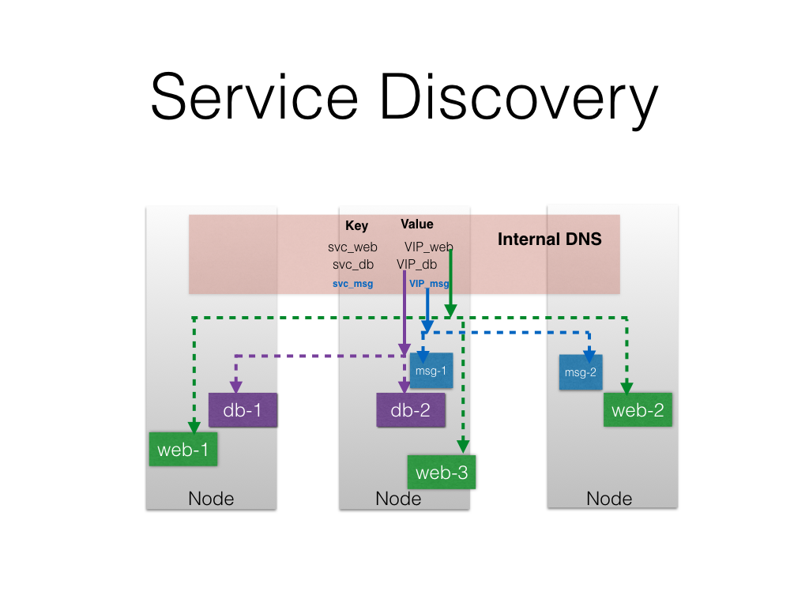

## What are containers ?

## Need for orchestration

### Container Orchestrator
- Docker Swarm
- Kubernetes
- Mesos Marathon
- Hashicorp Nomad
- Amazon ECS 
- Fleet

### Container Management Platforms
- Tectonic
- Rancher
- Platform9

## What is needed to do the Container Orchestration

### Multiple Nodes to be part of a cluster

### Unique ID/Token to bind all the nodes in a unique cluster

### Container Engines

- runC
- Docker 
- Rkt

### Single source of truth about configuration for nodes

- Key-Value Store like etcd, consul

### Network for containers of different nodes to talk to each other

- Some form of Overlay network like VxLAN. 
- With possibility to plug different neworking solution like Calico. 
- TODO

### One or more cluster master to manage the cluster and schedule the jobs/tasks  

### Scheduler to schedule the containers on nodes based on

- Constraints, like run the container where SSD storage is available
- Affinity

### Service discovery within the cluster

- Internal DNS server
- Through environment variables 
- Load balancer, HA proxy

### Access the services from external world

### Access to external shared storage

#### Volume plugins
