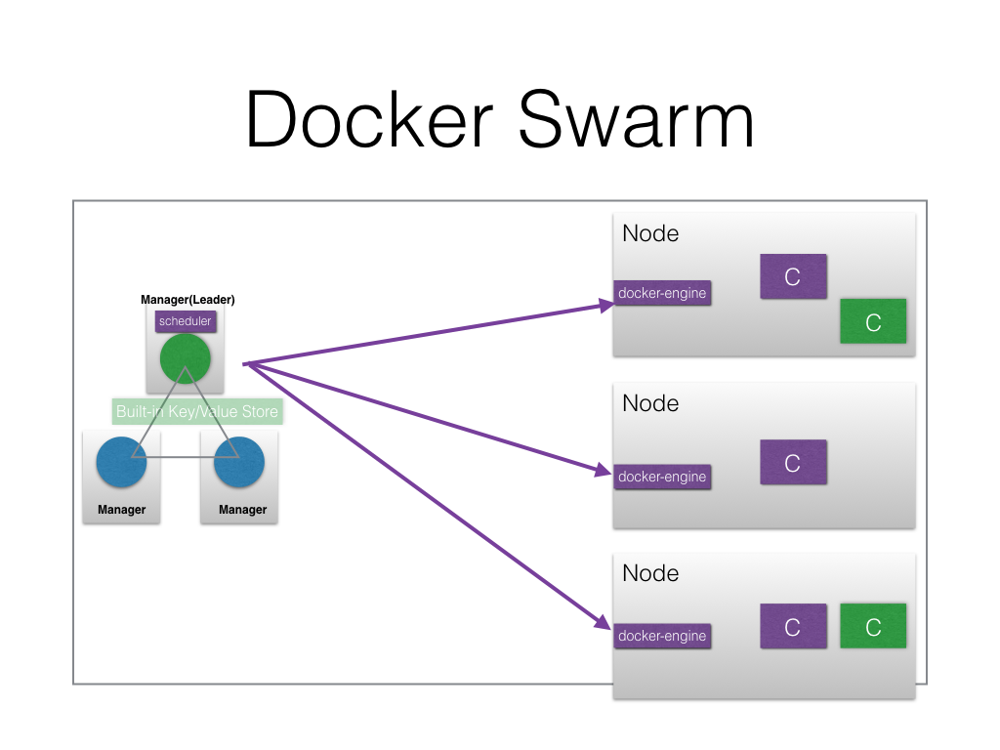

## Architecture 

### Components



#### Manager
##### Scheduling 
- Resource Availability
- Labels and constrains 
 - Engine label and constrains
 - Node label and constrains
 - Example  
  - Labels
   - env=test, storage=ssh
  - Constrains 
   - Nodes
- Strategy and affinity
  - In Swarm mode only strategy supported is spread

##### Service Discovery 
Runs an internal DNS server, which register are services created with Docker Swarm mode.

#### Nodes
Runs the contaniner using docker-engine.


As shown above, with Docker Swarm mode the order of creation is following:-
- Services
  - tasks
    - containers

### Defining an application 

#### RSVP application
##### Docker Compose
```
version: '2'
services:
 mongodb:
   image: mongo:3.3
   expose:
     - "27017"
   environment:
    MONGODB_DATABASE: rsvpdata
   networks:
    - rsvpnet

 web:
   image: teamcloudyuga/rsvpapp
   ports:
    - "5000:5000"
   environment:
    MONGODB_HOST: mongodb
   networks:
    - rsvpnet

networks:
  rsvpnet:
```

##### Docker Application Bundle
```
{
  "Services": {
    "mongodb": {
      "Env": [
        "MONGODB_DATABASE=rsvpdata"
      ],
      "Image": "mongo@sha256:919d22a962b1913a2f57cbcd772689b4061cc05a7ccdf32a1900b58462c351d4",
      "Networks": [
        "rsvpnet"
      ],
      "Ports": [
        {
          "Port": 27017,
          "Protocol": "tcp"
        }
      ]
    },
    "web": {
      "Env": [
        "MONGODB_HOST=mongodb"
      ],
      "Image": "teamcloudyuga/rsvpapp@sha256:06923b50d69ee693ea4b3fc156f720d672a56508a3d66b0fe6f558715624e019",
      "Networks": [
        "rsvpnet"
      ],
      "Ports": [
        {
          "Port": 5000,
          "Protocol": "tcp"
        }
      ]
    }
  },
  "Version": "0.1"
}
```

### High availablity of application 
- Replicas of tasks running 
- Multiple nodes

#### Service discovery and Load Balancing an application
- iptables 
  - classifies, modify and take decisions based on the packet
- IPVS
  - load balancer at transport layer available in the Linux kernel

#### Autoscaling an application 
- No inbuild primitive yet.  

#### Rolling upgrade and rollback of an application 
```
$ docker service update --image teamcloudyuga/rsvpapp:1 --update-delay 10s rsvp
```

#### Internally connecting to other application 
- Each service get registred with the internal discovery service
- Applications can contact other using service VIP 

#### Networking option to connect applications with-in the cluster  
- Overlay network
- Network Plugins

#### Accessing the application from external world 
- Once a service publishes a port, routing mesh maps the published port on all the nodes
- Any external client can query the published port on any nodes to reach the desired service 
- A Load Balancer (HAProxy/Nginx) can be configured to map an endpoint to the pubished port on the nodes of the cluster.


#### Managing storage for application
- **bind mounts** 
```
$ docker service create \
  --name my-service \
  --mount type=bind,source=/path/on/host,destination=/path/in/container \
  nginx:alpine
```
- **named volumes**
```
$ docker service create \
  --name my-service \
  --replicas 3 \
  --mount type=volume,source=my-volume,destination=/path/in/container,volume-label="color=red",volume-label="shape=round" \
  nginx:alpine
```

Detailed docs are available [here](https://github.com/docker/docker/blob/master/docs/reference/commandline/service_create.md#add-bind-mounts-or-volumes). 

## Demo 
Get the 	

```
$ git clone https://github.com/cloudyuga/container-orchestration.git
$ cd docker-swarm
$ export DO_TOKEN=adfvvfvs............
$ vagrant up --provider=digital_ocean
$ vagrant ssh manager
$ git clone https://github.com/cloudyuga/rsvpapp.git
$ cd rsvpapp
```

On Manager 
```
root@manager:~/rsvpapp# docker swarm init --advertise-addr=<MANAGER_IP>
Swarm initialized: current node (<MANAGER_NODE_ID>) is now a manager.

To add a worker to this swarm, run the following command:

    docker swarm join \
    --token SWMTKN-1-<TOKEN> \
    <MANAGER_IP>:2377

To add a manager to this swarm, run 'docker swarm join-token manager' and follow the instructions.
```

On Worker1
```
root@worker1:~# docker swarm join \
>     --token SWMTKN-1-<TOKEN> \
>     <MANAGER_IP>:2377
This node joined a swarm as a worker.
```

On Worker2
```
root@worker2:~# docker swarm join \
>     --token SWMTKN-1-<TOKEN> \
>     <MANAGER_IP>:2377
This node joined a swarm as a worker.
```


On Manager
```
$ docker info
$ docker service create alpine ping 8.8.8.8
$ docker service ps <serviceID>
$ docker sevice inspect  <serviceID>
$ docker service update <serviceID> --replicas 4
$ docker service create --name web --publish 80:80 --replicas 4 nginx
```

Deploy the RSVP service manually
```
$ docker network create --driver overlay rsvpnet
$ docker service create --name mongodb  -e MONGODB_DATABASE=rsvpdata --network rsvpnet  mongo:3.3
$ docker service create --name rsvp  -e MONGODB_HOST=mongodb --publish 5000  --network rsvpnet teamcloudyuga/rsvpapp
$ docker service ls
$ docker service inspect rsvp
$ docker service scale rsvp=5
$ docker service rm rsvp
$ docker service rm mongodb
```

Deploy the RSVP service with Docker Application Bundle
```
$ docker deploy rsvpapp
$ docker service ls
$ docker service inspect rsvpapp_web
$ docker service scale rsvpapp_web=4
```


Other Examples 
```
$ docker service update --image teamcloudyuga/rsvpapp:v1 --update-delay 10s rsvp
$ docker service create --name util --network rsvp --mode global alpine sleep 200
$ docker service update stateful --constraint-add node.hostname==$HOSTNAME
$ docker service update stateful --limit-memory 100M
$ docker service update statful --mount-add type=volume,source=somename,target=/data
```

Managing Nodes 
```
$ docker node update <node_name> --availability <active/pause/drain>
$ docker swarm promote
$ docker swarm demote
$ docker swarm leave
```

### Destroy the setup
```
$ vagrant destory -f
```
